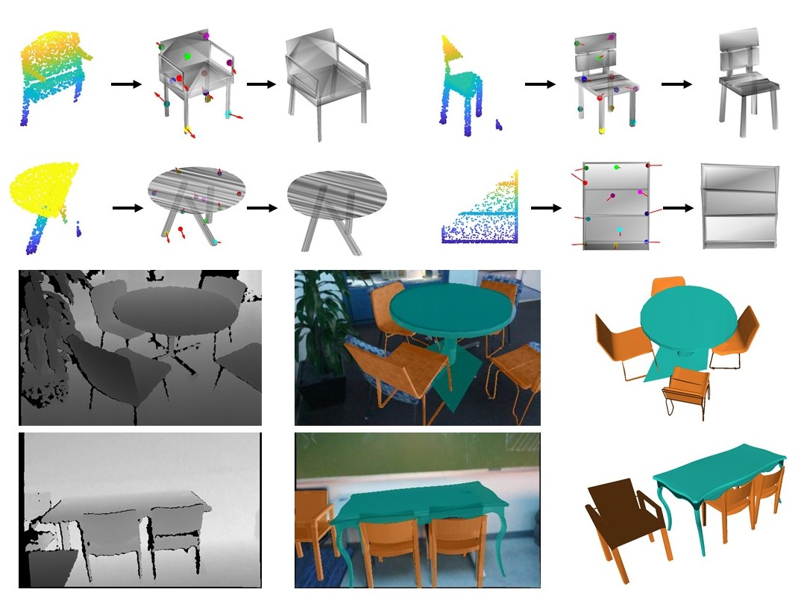

# KP-RED
Offical Pytorch Implementation of CVPR2024 KP-RED: Exploiting Semantic Keypoints for Joint 3D Shape Retrieval and Deformation

[//]: # (&#40;[link]&#40;https://arxiv.org/abs/2203.07918&#41;&#41;)



## Installation

Install using [conda](https://docs.conda.io/en/latest/):
```
conda env create -f environment.yml 
conda activate kpred
```

Download [ShapeNet](https://shapenet.org/download/shapenetcore) to `data/shapenet/shape_data`.


## Training

To train the deformation module on the chair category with input of full target point clouds run:
```
python scripts/main.py -c configs/chair-full.yaml
```

Then, to train the deformation module on the chair category with input of partial target point clouds run:
```
python scripts/main.py -c configs/chair-partial.yaml
```
The option `ckpt` should be customized as the path of trained deformation model for full point clouds.

Finally, to train the retrieval module run:
```
python scripts/main.py -c configs/chair-retrieval.yaml
```
The option `ckpt` should be customized as the path of trained deformation model for full point clouds.

## Testing
To test the trained R&D model on full point clouds run:
```
python scripts/main.py -c configs/chair-full.yaml -t configs/test.yaml 
```
The option `ckpt` should be customized as the path of trained deformation model for full point clouds.
The option `latent_ckpt` should be customized as the path of trained retrieval model.

To test the trained R&D model on partial point clouds on PartNet run:
```
python scripts/main.py -c configs/chair-full.yaml -t configs/test_partial.yaml 
```
The option `ckpt` should be customized as the path of trained deformation model for partial point clouds.
The option `latent_ckpt` should be customized as the path of trained retrieval model.
The option `points_dir` should be customized as the path for storing the generated partial point clouds.
The option `test_partial_ratio` should be set from 0 to 1.

To visualize the results run:
```
python browse3d/browse3d.py --log_dir logs/chair/test --port 5050
```
and open `localhost:5050` in your web browser.

## Acknowledgment
Our implementation leverages the code from [KeypointDeformer](https://tomasjakab.github.io/KeypointDeformer/).